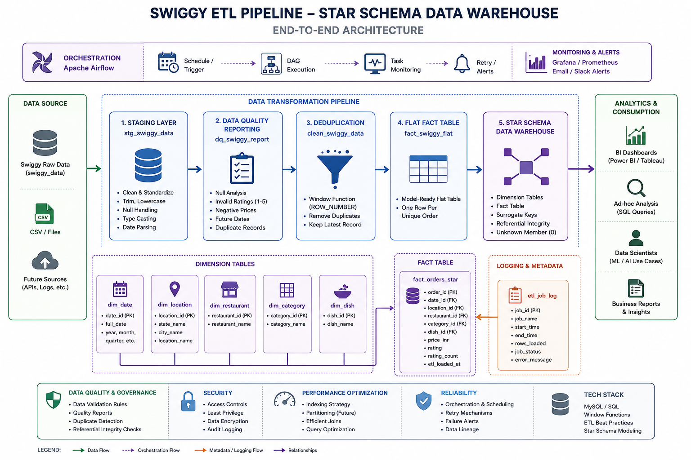

# Swiggy End-to-End ETL Pipeline & Analytics Project

## Project Background

This project started as a guided walkthrough of a Swiggy food delivery 
sales dataset, originally demonstrated using MS SQL Server.

**Original tutorial:** [Swiggy Sales Data Analysis — Full Project](https://youtu.be/baVm9YUgBIQ)  
**Original stack:** MS SQL Server · Basic star schema · KPI queries

---

## What Went Wrong — And What It Led To

When replicating the project in **MySQL Workbench**, I hit a join explosion 
problem that the tutorial did not cover — a result of environment differences 
between MS SQL Server and MySQL's query execution behaviour.

Rather than switching tools to match the tutorial, I diagnosed the root cause:
the staging layer had no deduplication, meaning duplicate rows were being 
multiplied across every join. Fixing it properly meant rebuilding the pipeline 
from the ground up using real analytics engineering practices.

That decision turned a guided tutorial into an independent engineering project.

---

## How This Project Differs From the Original

| Area | Original Tutorial | This Project |
|---|---|---|
| Database | MS SQL Server | MySQL 8 |
| Pipeline structure | Raw → Star Schema (2 layers) | Raw → Staging → DQ → Clean → Fact → Star Schema (6 layers) |
| Data quality | None | Persisted DQ report table with 8 checks |
| Deduplication | None | ROW_NUMBER() window function, non-destructive |
| ETL audit | None | etl_job_log table tracking every pipeline run |
| Null handling | Basic | Unknown sentinel records in every dimension |
| Referential integrity | Assumed | Validated with post-load LEFT JOIN checks |
| Indexing | Basic PKs/FKs | Composite indexes designed for analytical query patterns |
| Problem origin | Tutorial-guided | Self-diagnosed join explosion, independent solution |

---

## Overview

A full-stack data analytics project built on real Swiggy food delivery sales 
data. The pipeline transforms raw CSV data into a production-grade star schema 
using layered ETL architecture, with data quality reporting, deduplication, 
and an analytics layer designed to power a Power BI dashboard.
---

## Project Architecture


*Architecture diagram illustrating the pipeline design and data flow.*

```
┌─────────┐    ┌─────────┐    ┌──────────────┐    ┌───────────────┐    ┌─────────────┐    ┌──────────┐
│ Raw CSV │ →  │ Staging │ →  │ Data Quality │ →  │ Deduplication │ →  │ Star Schema │ →  │ Power BI │
└─────────┘    └─────────┘    └──────────────┘    └───────────────┘    └─────────────┘    └──────────┘
```
| Layer | Table | What happens here |
|---|---|---|
| Source | `swiggy_data` | Raw CSV import, no transformations |
| Staging | `stg_swiggy_data` | TRIM, LOWER, NULLIF, date casting, type safety |
| Quality | `dq_swiggy_report` | Null counts, invalid ratings, negative prices, future dates, duplicates |
| Clean | `clean_swiggy_data` | Deterministic dedup via ROW_NUMBER() — non-destructive |
| Intermediate | `fact_swiggy_flat` | Model-ready flat table before dimensional split |
| Star Schema | `fact_orders_star` + 5 dims | Final analytical model for dashboarding |

---

## Star Schema Design

**Fact Table:** `fact_orders_star`  
Grain: one row = one ordered dish at a restaurant, at a location, on a date

**Dimension Tables:**
- `dim_date` — year, month, quarter, week, day
- `dim_location` — state, city, location
- `dim_restaurant` — restaurant name
- `dim_category` — food category
- `dim_dish` — dish name

---

## Key Engineering Decisions

**ETL Job Log** — every pipeline run is recorded with start time, end time, 
row count, and status. A team can monitor pipeline health without reading code.

**Unknown dimension sentinels** — each dimension table has an "unknown" record 
at id=1. Foreign keys fall back to this instead of NULL, preserving referential 
integrity even when source data is incomplete.

**Non-destructive deduplication** — ROW_NUMBER() over a full business key 
partition keeps the latest record and discards duplicates without deleting 
anything, leaving a full audit trail in the staging layer.

**Data quality as a first-class layer** — the DQ report is persisted as a 
table, not just printed. This means quality metrics are queryable and 
comparable across pipeline runs.

**Composite indexes on the fact table** — indexes on date_id, restaurant_id, 
and category_id together support the most common analytical query patterns 
without over-indexing.

---

## Business Questions Answered

- What are the monthly and quarterly order trends?
- Which cities and states drive the most revenue?
- Which restaurants have the highest order volumes and ratings?
- What are the most ordered dishes and food categories?
- How are customer ratings distributed?
- What does average spend per order look like across locations?

---

## What I Learned Building This

- How join explosions happen in ETL and how to diagnose them
- Why staging tables exist and what they protect you from
- The difference between a flat fact table and a proper star schema
- How to use ROW_NUMBER() for safe, auditable deduplication
- Why data quality checks need to be stored, not just run
- How to structure SQL like an analytics engineering pipeline (not just queries)

---

## Tools & Technologies

| Tool | Purpose |
|---|---|
| MySQL 8 | ETL pipeline, star schema, analytics queries |
| MySQL Workbench | Development and execution environment |
| Power BI | Dashboard and reporting layer |
| Git / GitHub | Version control and portfolio publishing |

---

## How to Run

1. Import the raw CSV into MySQL as `swiggy_data`
2. Run scripts in order — `sql/01` through `sql/06`
3. Each script must complete successfully before running the next
4. Validate row counts at each layer using the validation queries in `05_fact_model.sql`
5. Connect Power BI to `fact_orders_star` and the five dimension tables

---

## Project Status & Roadmap

### Completed
- [x] Staging layer with cleaning and standardisation
- [x] Data quality report (8 checks, persisted as table)
- [x] Deduplication via ROW_NUMBER()
- [x] Star schema (fact + 5 dimensions)
- [x] ETL job logging and referential integrity validation

### In Progress
- [ ] Analytics queries and KPI layer
- [ ] Power BI dashboard

### Planned (v2)
- [ ] Apache Airflow orchestration
- [ ] Incremental loading strategy
- [ ] Partitioning for performance
- [ ] Grafana monitoring integration
---

**Author:** Stephen Adejo  
**Domain:** Data Analytics · Analytics Engineering · Data Warehousing  
**Stack:** MySQL · Power BI · Git
